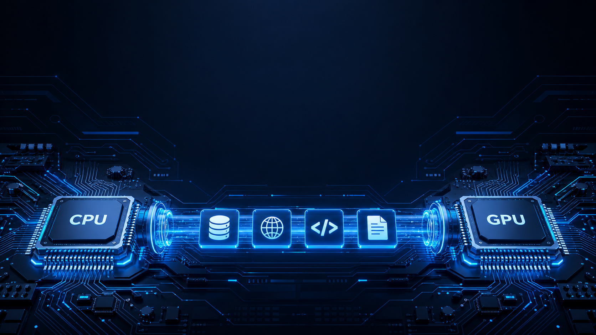
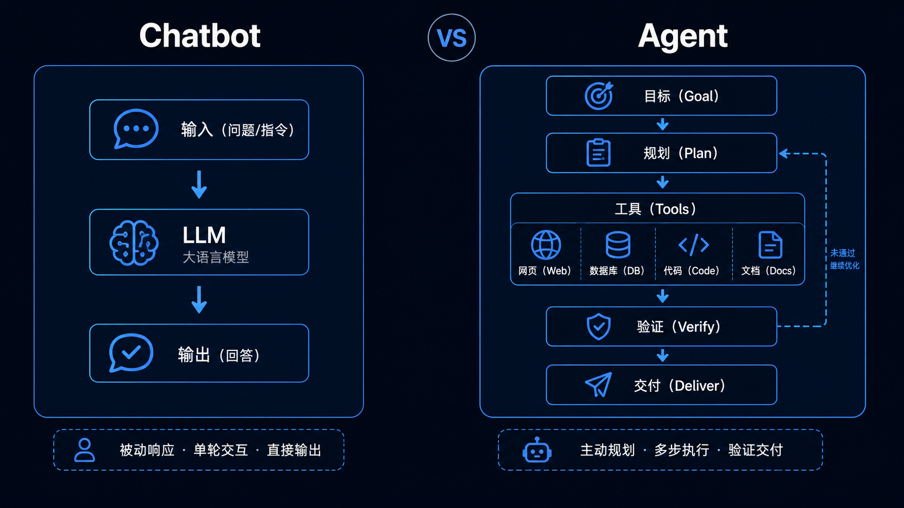
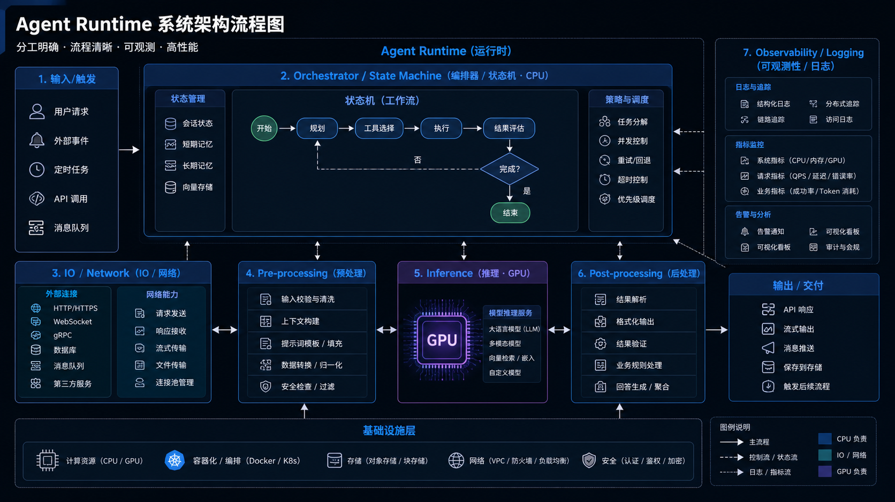
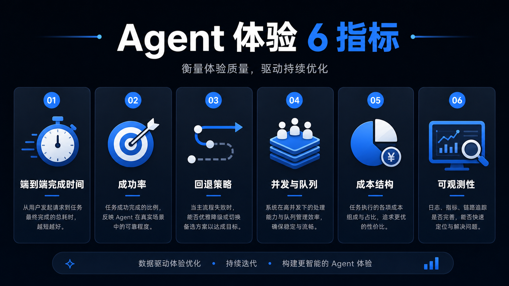

# 从“会聊天”到“会做事”：为什么 NVIDIA 要做 Agent CPU？

> 过去两年，我们习惯把 AI 进步等同于“更强的大模型”。但 2026 年开始，一个更关键的变化正在发生：**Agent（能调用工具、执行任务的 AI）让整套计算栈被迫重做**。  
> 当 AI 从“输出文字”走向“完成任务”，GPU 不再是唯一主角——**CPU 反而变成系统瓶颈与体验天花板**。这也是为什么 NVIDIA 会在官方博客里谈“面向 Agentic AI 的 CPU（Vera）”。  
>
> 来源：NVIDIA 官方博客 https://blogs.nvidia.com/blog/vera-cpu-agentic-ai/

---

## 01 什么是 Agent？它和 Chatbot 的差别在哪

把 Chatbot 想成“会写作的发动机”，把 Agent 想成“能接单的运营团队”。

- **Chatbot**：一次输入 → 一次输出，主要成本在模型推理。
- **Agent**：目标输入 → 多轮规划 → 调用工具（搜索/代码/表格/数据库/邮件/工单/浏览器）→ 结果交付。  
  关键变化是：推理只是其中一段，更多时间花在“找数据、跑流程、等 I/O、做校验、做回退”。

一句话：**Agent 是一个长链路的“系统”，不是一个单点模型。**

---

## 02 Agent 链路里，CPU 到底在忙什么？

很多人以为“AI=GPU”，但在 Agent 场景里，CPU 的工作量会陡增，常见包括：

1) **任务编排与状态机**  
Agent 不是一句话结束，它要维护“当前进度/上下文/下一步动作/失败重试/回退策略”。这些大多在 CPU 侧做调度。

2) **I/O 与数据搬运（最容易卡体验）**  
调用工具意味着网络请求、读写文件、访问数据库、拉取网页、解析文档。  
**GPU 在等数据时很贵**，而 CPU 往往是把 I/O 管顺的核心。

3) **推理前后处理**  
检索增强（RAG）的切分/向量检索触发、JSON 结构化校验、内容安全过滤、缓存命中、日志与可观测性……这些都是“系统工程”。

4) **多模型/多工具协作**  
一个 Agent 往往不是“一个模型单打独斗”，而是：小模型做分类/路由，大模型做生成，工具做执行。CPU 负责把它们串起来。

结论：**Agent 让“系统效率”决定最终体验，而系统效率往往由 CPU/I/O/调度决定。**

---

## 03 为什么现在需要“为 Agent 重新设计 CPU”？

因为 Agent 时代的用户体验指标变了：

- Chatbot 时代你关心：回答好不好、token 成本高不高  
- Agent 时代你更关心：**能不能按时完成、会不会翻车、失败能不能自救、并发上来会不会崩、整体成本能不能控**

这会把压力推向三个方向：

- **更低延迟的编排与更稳定的吞吐**（否则“工具调用 + 等待”会把体验拖成 PPT）
- **更高的可靠性与可观测性**（企业客户要能追责、能复盘、能治理）
- **更好的端到端成本**（GPU 很贵，把不该占 GPU 的活挪走，成本立刻下降）

所以你会看到：硬件叙事从“算得更快”转向“跑得更稳、更省、更可控”。这就是“Agent 栈重做”的本质。

---

## 04 对普通人/创作者意味着什么？不是买 CPU，而是内容机会来了

你不需要关心 Vera 的每个参数，但你可以抓住一个更能传播的讲法：

### 机会 A：做“反直觉科普”——为什么卷 GPU 之外，还要卷 CPU？

爆点很强：观众已经对“又一个模型”疲劳，但对“AI 时代 CPU 回归”会好奇。

### 机会 B：做“体验拆解”——Agent 为什么慢？慢在哪里？怎么变快？

用真实链路讲清楚：规划→检索→工具→校验→回退→交付。观众立刻能对号入座。

### 机会 C：做“产业趋势”——Agent 让哪些岗位/产品先吃到红利？

例如：企业工作流、客服/外呼、数据分析、运维、合规审计、内容生产流水线。

---

## 05 一张图讲清：Agent 时代你应该盯哪些指标

建议你在内容里反复强调这 6 个“可衡量”的指标：

- **端到端完成时间**：从“接到任务”到“交付结果”
- **成功率**：一次成功 / 需要重试 / 失败放弃
- **回退策略**：失败是否能自动降级（换工具/换模型/换路径）
- **并发与队列**：高峰期是否排队、是否雪崩
- **成本结构**：GPU 推理 vs CPU/I/O/存储/网络的占比
- **可观测性**：链路追踪、日志、可复盘性（企业客户最在意）

---

## 结尾：最适合公众号的一句话收束

**Agent 时代不是“模型更强”，而是“系统更像生产线”。**  
当 AI 从内容生成走向任务交付，硬件与系统架构会决定大多数人的真实体验——这就是为什么 NVIDIA 要谈“面向 Agentic AI 的 CPU（Vera）”。

（全文唯一硬事实来源：NVIDIA 官方博客 https://blogs.nvidia.com/blog/vera-cpu-agentic-ai/；本文对“趋势影响”的部分为基于行业常识的归纳，未涉及无来源的价格/跑分/交付时间断言。）

